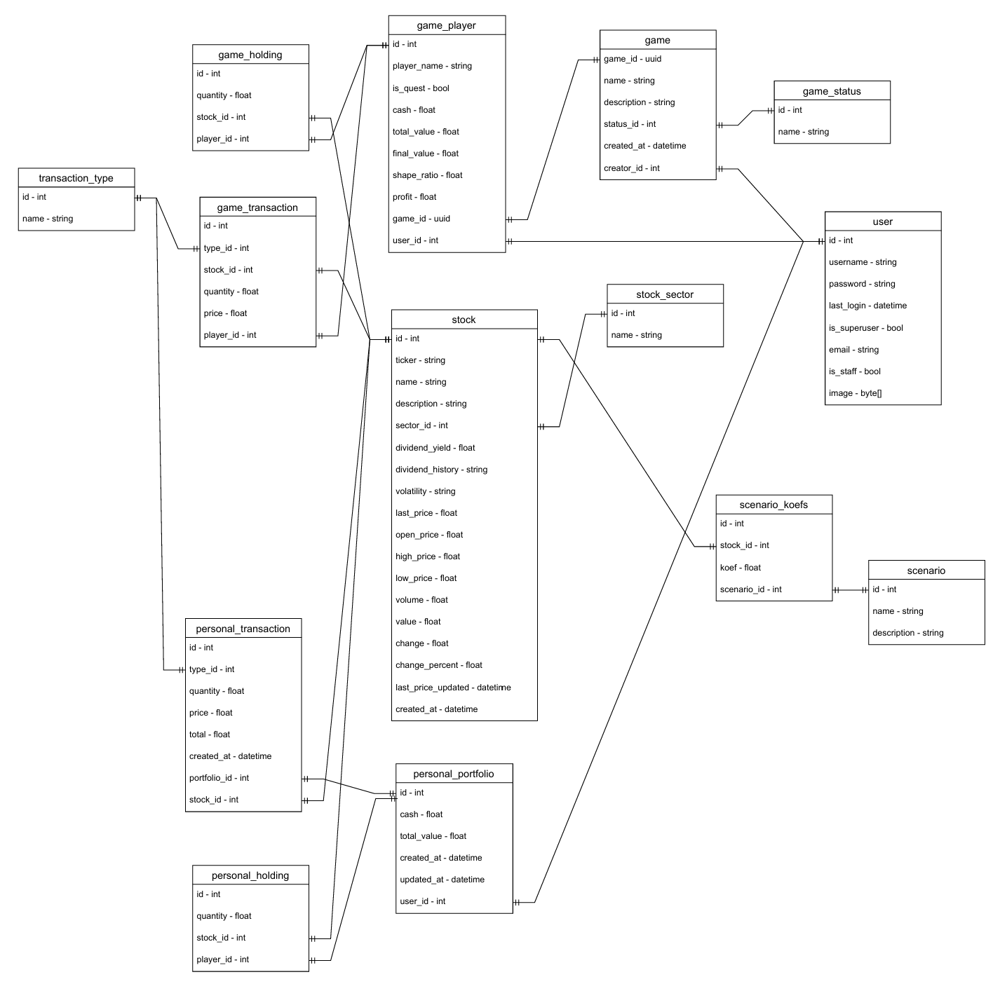

# RiskLab: Инструкция по запуску
## О продукте
Мы разрабатываем интерактивный веб-тренажёр, который позволяет на реальных данных Московской биржи собрать инвестиционный портфель и проверить его устойчивость с помощью стресс-сценариев

[Ссылка на сайт](https://risklab-j165.onrender.com/)

###  Тестовые данные для входа
| Логин | Пароль          | Роль                 |
|-------|-----------------|----------------------|
| admin | admin123        | администратор        |
| Ivan  | jjsTjK52va5fz3U | обычный пользователь |
| Misha | jjsTjK52va5fz3U | обычный пользователь |
| Roma  | jjsTjK52va5fz3U | обычный пользователь |

## Инструкция
Следуйте этой инструкции для настройки и запуска проекта **RiskLab**. Все команды выполняются в терминале.  
**Важно:** Убедитесь, что у вас установлены `Python` и `pip`.

---

## Запуск проекта

### 1 скачайте и запустите докер:

[Docker Desktop](https://www.docker.com/products/docker-desktop/)

### 2 Клонируйте проект:

#### Для Windows:
```bash
git clone https://github.com/nto-itmo-hub/IT-liceisti/
```

#### Для macOS/Linux:
```bash
git clone https://github.com/nto-itmo-hub/IT-liceisti/
```

---

### 3 Запустите проект с помощью Docker Compose:
Выполните следующую команду для сборки и запуска контейнеров:
```bash
docker-compose up --build
```

Эта команда:
1. Скачает необходимые Docker-образы.
2. Соберет контейнеры для вашего проекта.
3. Запустит сервисы: Django, PostgreSQL и миграции.


---

### 4 Откройте сайт:
Перейдите по адресу:  
[http://127.0.0.1:8000/](http://127.0.0.1:8000/)

> **Важно:** Не закрывайте терминал, пока сервер работает.

---

## Возможные ошибки запуска

### Ошибка при запуске docker-compose up --build:
Если вы сталкиваетесь с ошибками, попробуйте выполнить следующие шаги:
1. Убедитесь, что у вас установлены последние версии Docker и Docker Compose.
2. Перезапустите Docker.

---

## Документация 

- [Исходники документов (по этапам)](docs/)
- [Исходники диаграмм](design/)
- [Исходники исторических данных](history_csv/)

> Описание архитектуры проекта находится в [Файл 3 этапа](docs/stage_3.pdf)

### ER диаграмма



###  Use case


###  Диаграмма компанентов


---

 **Совет:** Если у вас возникнут вопросы, создайте Issue в репозитории GitHub.